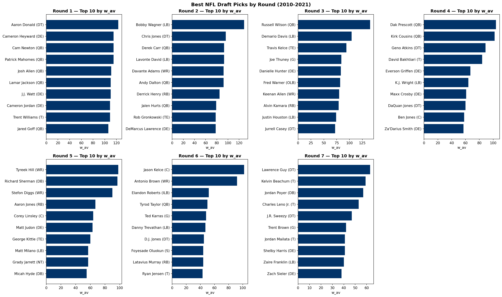
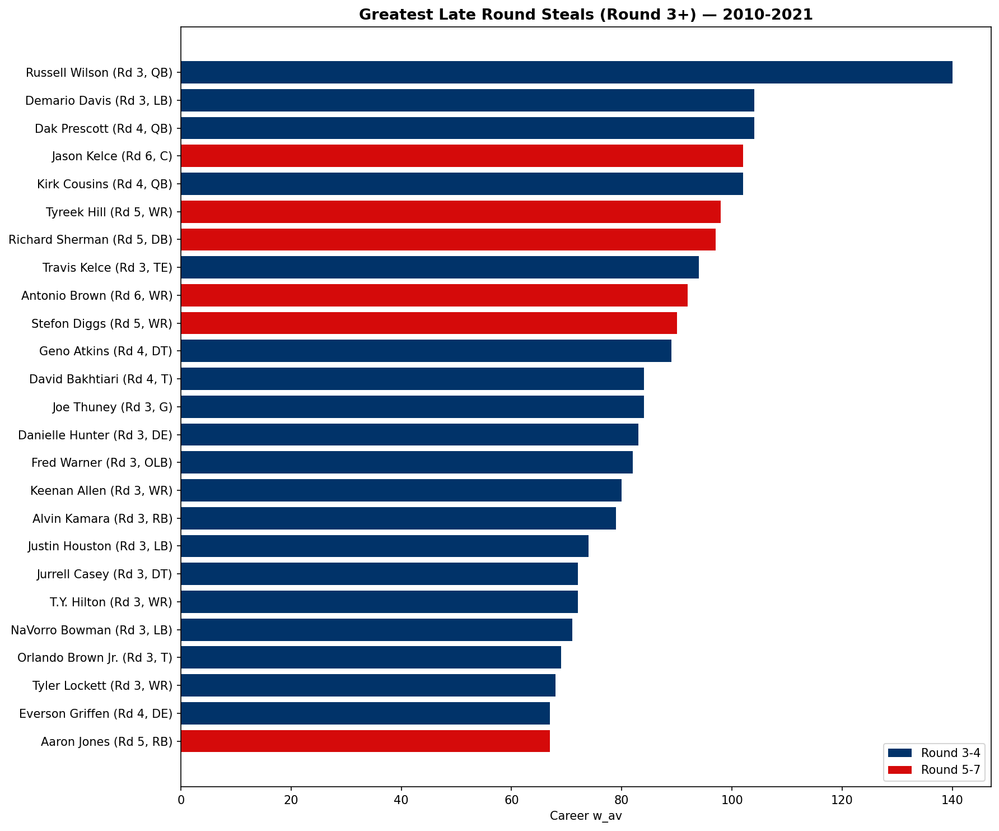
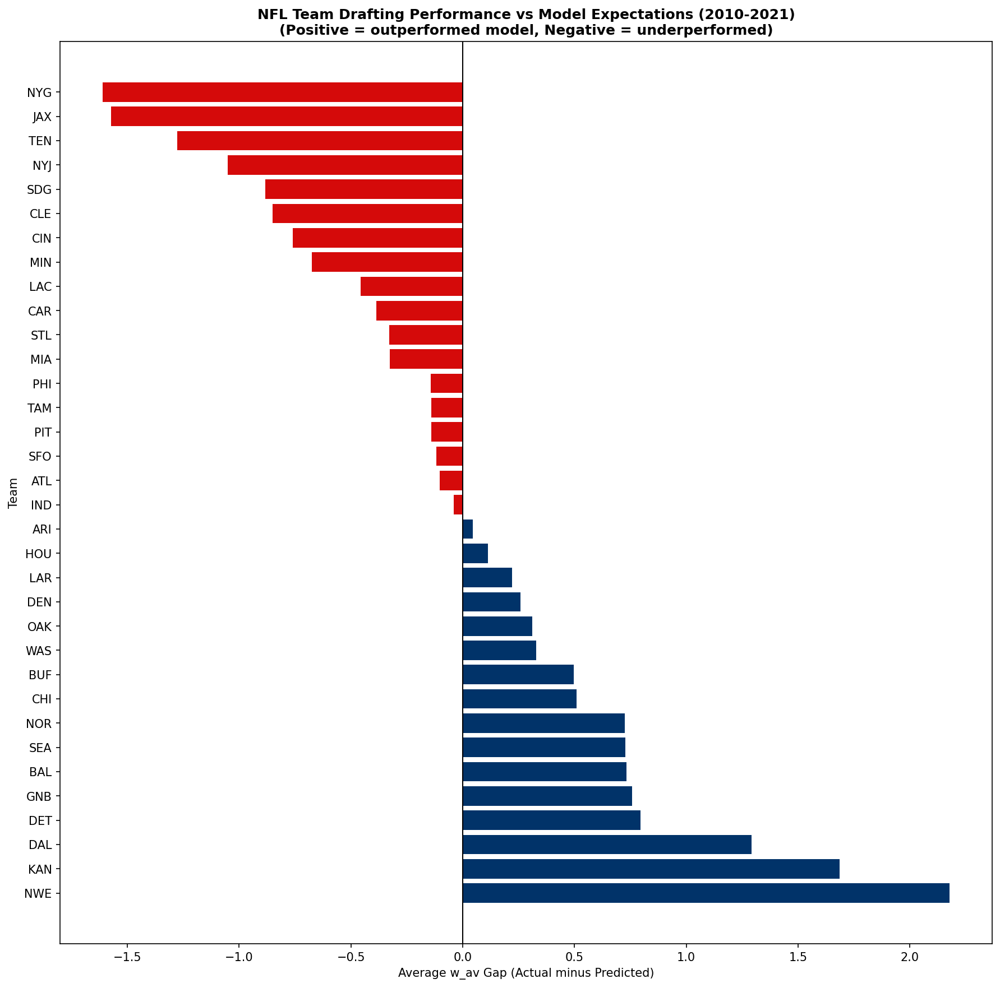
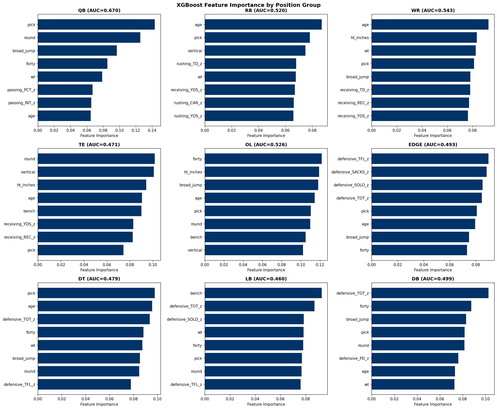

# NFL Draft Model

## Overview
This project builds a machine learning model to predict NFL draft success using college statistics and NFL combine measurables. We analyze which pre-draft factors best predict NFL career value, identify historically overdrafted and underdrafted players, rank team drafting performance, and examine which draft classes produced the most value relative to expectations.

## Key Findings
- **QB is the most predictable position (AUC 0.670)** — college accuracy and draft slot provide meaningful signal, all other positions hover near random (AUC 0.47-0.54)
- **Russell Wilson is the greatest late round steal** — 140 w_av from Round 3, Pick 75, the highest career value of any post-Round 2 pick in 2010-2021
- **Jason Kelce (Round 6) and Antonio Brown (Round 6)** — all-time greats found in the 6th round, proof that elite talent exists throughout the draft
- **New England Patriots are the best drafting organization** — +2.18 average w_av gap over model expectations across 89 picks (2010-2021)
- **New York Giants are the worst** — -1.61 gap, the largest negative deviation from model expectations
- **Age is a surprisingly strong predictor** — younger players at the same draft slot consistently outperform older ones
- **OL provides the best late round value** — maintains meaningful w_av through Round 7 better than any other position
- **The draft is genuinely hard to predict** — pre-draft data alone cannot reliably predict NFL success for most positions, confirming why teams invest heavily in scouting and film study beyond public statistics
- **Devin McCourty is the biggest model miss** — 20% predicted success, 71 w_av career. Small school DBs are systematically undervalued by public data

## Methodology
- **Data sources:** nfl_data_py (draft picks, combine data), CollegeFootballData.com API (college statistics)
- **Date range:** 2010-2021 draft classes (12 seasons, 2,779 players)
- **Outcome variables:** w_av (weighted approximate value, continuous) and success (binary — outperformed round median)
- **Features:** draft slot, age, college stats (position-specific, z-scored within position group), combine measurables (height, weight, 40 yard dash, bench, vertical, broad jump)
- **Model:** XGBoost classifier and regressor trained separately for each of 9 position groups
- **Evaluation:** 5-fold cross-validated AUC and R²
- **Matching:** Fuzzy name matching (rapidfuzz) to join college stats to draft picks at 69% match rate

## Repo Structure
```
nfl-draft-model/
├── data/
│   ├── raw/              # Raw data files (not tracked)
│   └── processed/        # Cleaned datasets (not tracked)
├── notebooks/
│   ├── 01_data_exploration.ipynb
│   ├── 02_college_stats.ipynb
│   ├── 03_feature_engineering.ipynb
│   ├── 04_modeling.ipynb
│   ├── 05_evaluation.ipynb
│   └── 06_draft_class_analysis.ipynb
├── outputs/
│   └── figures/
├── src/
├── requirements.txt
└── README.md
```

## How to Run
1. Clone the repo
2. Install dependencies: `pip install -r requirements.txt`
3. Get a free API key from [CollegeFootballData.com](https://collegefootballdata.com/key)
4. Create a `.env` file: `CFB_API_KEY=your_key_here`
5. Run notebooks in order: `01 → 06`

## Visualizations Preview









## Data Sources
- Draft picks and combine data: [nfl_data_py](https://github.com/nflverse/nfl_data_py)
- College statistics: [CollegeFootballData.com API](https://collegefootballdata.com)